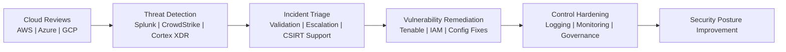

  

  
  
  
  

  <a href="#profile">Profile</a> •
  <a href="#security-focus">Security Focus</a> •
  <a href="#security-workflow">Workflow</a> •
  <a href="#experience-snapshot">Experience</a> •
  <a href="#education">Education</a> •
  <a href="#certifications">Certifications</a> •
  <a href="#platforms--tools">Tools</a> •
  <a href="#connect">Connect</a>

---

## Profile

This repository represents the professional portfolio of **Abdul Rauf Yousofzay**, a cybersecurity professional with experience across **cloud security, incident response, vulnerability management, enterprise infrastructure, and security operations**.

My work centers on strengthening security posture across cloud and enterprise environments through assessment, detection, triage, remediation, and governance-focused control improvement.

> Building stronger security posture across finance, government, and infrastructure environments.

## Security Focus

- Multi-cloud security assessments across **AWS, Azure, and GCP**
- Threat validation, incident triage, and response workflow improvement
- Vulnerability analysis and remediation prioritization
- IAM, logging, monitoring, and governance control reviews
- Security operations support in finance, government, and enterprise environments

## Security Workflow

## Career Highlights

| Area | Highlights |
|---|---|
| Cloud Security | Assessed controls, permissions, and misconfigurations across enterprise cloud environments |
| Detection & Triage | Worked with Splunk, CrowdStrike, Cortex XDR, and ExtraHop to improve threat visibility |
| Incident Response | Supported ransomware and incident response efforts across containment, eradication, and recovery |
| Vulnerability Management | Prioritized remediation of high-risk assets and helped remediate 150+ vulnerabilities |
| Governance | Aligned reviews and security decisions with NIST, CIS, and FedRAMP-related practices |

## Experience Snapshot

| Organization | Role | Focus |
|---|---|---|
| Capital One | Cybersecurity Engineer | Multi-cloud reviews, control assessments, detection coverage, governance |
| HHS / IHS Division | Cybersecurity Analyst | Threat assessments, Splunk triage, Tenable remediation, CSIRT support |
| Navy Federal Credit Union | Security Analyst | External threat analysis, FedRAMP-aligned assessments, secure access support |
| Network-Fort | Cybersecurity Intern | Endpoint remediation, Azure AD controls, XSOAR workflows, AWS IAM |
| Amazon Data Center | IT Support Associate | Infrastructure support, hardware troubleshooting, uptime improvement |

<strong>Expanded role detail</strong>

### Capital One
**Cybersecurity Engineer - Contract**  
**March 2026 - Present**

- Conduct security assessments across AWS, Azure, and GCP services
- Analyze cloud misconfigurations, excessive permissions, and management-plane risks
- Strengthen enterprise monitoring, policy enforcement, and detection coverage
- Support remediation planning and secure cloud governance improvements

### U.S. Department of Health and Human Services, IHS Division
**Cybersecurity Analyst - Contract**  
**January 2025 - February 2026**

- Performed threat and event assessments across CrowdStrike, Cortex XDR, ExtraHop, and Azure IAM Identity Center
- Investigated Splunk risk-based alerts to validate threats and escalate incidents
- Conducted vulnerability analysis in Tenable.sc and Tenable.io
- Supported CSIRT response and forensic investigations

### Navy Federal Credit Union
**Security Analyst - Contract**  
**January 2024 - December 2024**

- Supported analysis of suspicious websites and external threats
- Conducted risk assessments aligned with NIST 800-37 and FedRAMP
- Helped configure VPNs, VMs, and firewalls for secure access
- Trained new team members on security tools and IT protocols

## Education

| Degree | Institution | Notes |
|---|---|---|
| M.S. Cybersecurity Engineering | George Mason University | Secure Systems Design, Threat Modeling, Cloud Security |
| B.A.S. Cybersecurity | George Mason University | GPA 3.5, GMU Cybersecurity Association, CCDC |
| A.A.S. Cybersecurity | Northern Virginia Community College | GPA 3.7, Magna Cum Laude |

## Certifications

- [Databricks Certified Data Engineer Associate](https://credentials.databricks.com/49d31f7b-cb0d-474d-a351-a5c2ccdaf2ce#acc.EvaD2HL9)
- Security+
- Network+
- Splunk Core Investigating and Threat Hunting
- CSC - Network Administration
- CSC - Cybersecurity
- CSC - Governance, Risk, and Compliance

## Platforms & Tools

  
  
  
  
  
  
  
  

## Connect

  
  
  

