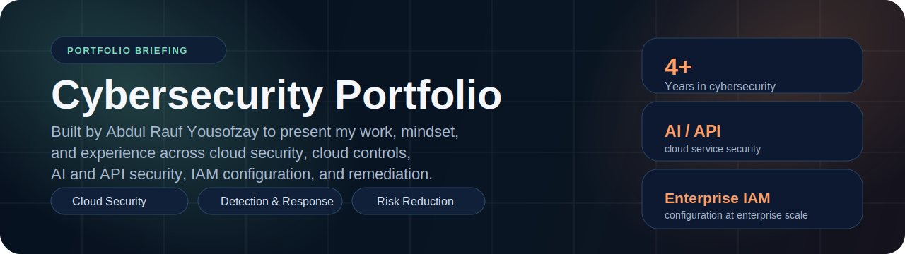
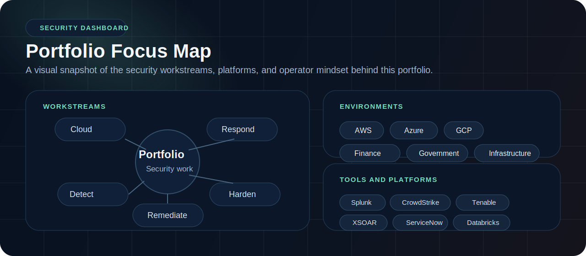
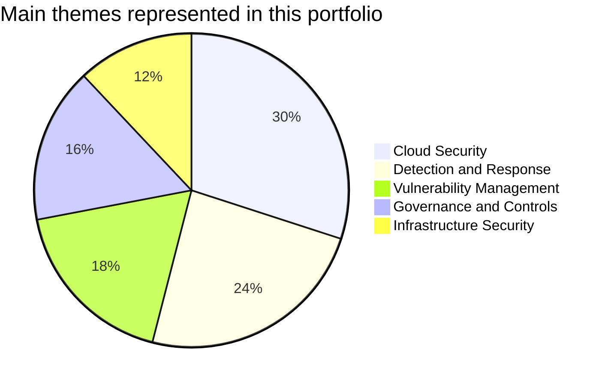
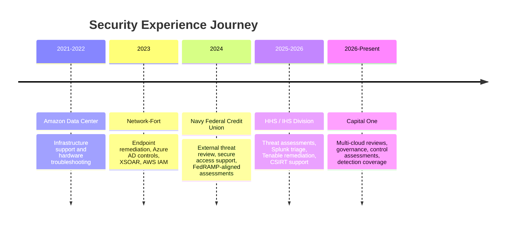
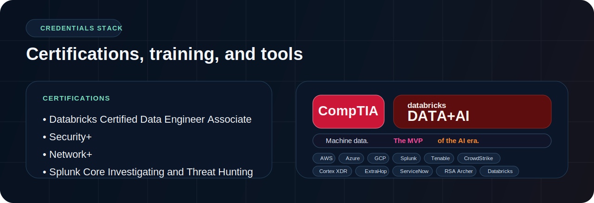

  

  <a href="#why-i-built-this-repo">Why I Built This Repo</a> •
  <a href="#how-i-approach-security">How I Approach Security</a> •
  <a href="#security-dashboard">Dashboard</a> •
  <a href="#portfolio-theme-mix">Theme Mix</a> •
  <a href="#experience-journey">Experience</a> •
  <a href="#education">Education</a> •
  <a href="#credentials">Credentials</a> •
  <a href="#operator-toolkit">Toolkit</a> •
  <a href="#connect">Connect</a>

---

## Why I Built This Repo

I built this repository as the home for my cybersecurity portfolio.

Instead of only dropping in a resume, I wanted a place that shows how I think about security work, the environments I have supported, and the kind of problems I like solving. This repo is meant to feel like a practical portfolio briefing: clear, technical, and still personal.

It also reflects work I have done across cloud security, incident response, vulnerability management, governance, and enterprise security operations.

## How I Approach Security

- I like security work that turns messy technical findings into clear action.
- I care about controls that are useful in real environments, not just good on paper.
- I enjoy connecting cloud risk, threat detection, remediation, and governance into one workflow.

## Security Dashboard

  

## Portfolio Theme Mix

This chart shows the main themes I emphasize across this portfolio.

## Experience Journey

## Education

| Degree | Institution | Notes |
|---|---|---|
| M.S. Cybersecurity Engineering | George Mason University | Secure Systems Design, Threat Modeling, Cloud Security |
| B.A.S. Cybersecurity | George Mason University | GPA 3.5, GMU Cybersecurity Association, CCDC |
| A.A.S. Cybersecurity | Northern Virginia Community College | GPA 3.7, Magna Cum Laude |

## Credentials

  

- [Databricks Certified Data Engineer Associate](https://credentials.databricks.com/49d31f7b-cb0d-474d-a351-a5c2ccdaf2ce#acc.EvaD2HL9)
- Security+
- Network+
- Splunk Core Investigating and Threat Hunting
- CSC - Network Administration
- CSC - Cybersecurity
- CSC - Governance, Risk, and Compliance

## Operator Toolkit

These are some of the platforms and technologies that show up most often across my work.

  
  
  
  
  
  
  
  
  
  
  
  

## Connect

  
  
  

