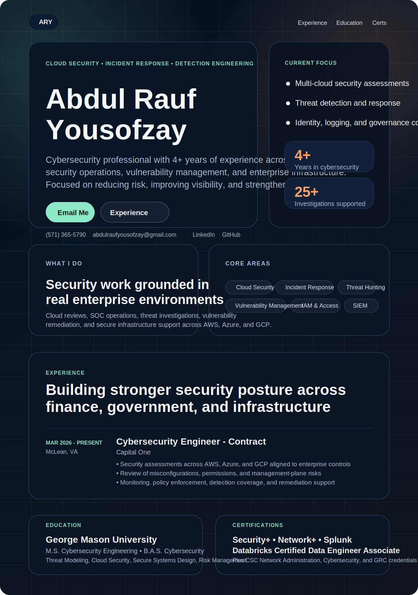

  

  <a href="#overview">Overview</a> •
  <a href="#current-focus">Current Focus</a> •
  <a href="#professional-experience">Experience</a> •
  <a href="#career-highlights">Career Highlights</a> •
  <a href="#education">Education</a> •
  <a href="#certifications">Certifications</a> •
  <a href="#connect">Connect</a>

---

## Overview

This repository represents the professional portfolio of **Abdul Rauf Yousofzay**, a cybersecurity professional with experience across **cloud security, incident response, vulnerability management, enterprise infrastructure, and security operations**.

The goal of this portfolio is to present a **clean GitHub-facing portfolio summary directly on the repository page**, using the same general tone and visual direction as the website itself: focused, modern, and centered on real security work.

## Current Focus

- Multi-cloud security assessments across **AWS, Azure, and GCP**
- Threat validation, incident triage, and response workflow improvement
- Vulnerability analysis and remediation prioritization
- IAM, logging, monitoring, and governance control reviews
- Security operations support in finance, government, and enterprise environments

## Career Highlights

| Area | Highlights |
|---|---|
| Cloud Security | Reviewed cloud controls, misconfigurations, permissions, and governance posture across enterprise environments |
| Incident Response | Supported ransomware and incident response activities across containment, eradication, and recovery |
| Detection & Triage | Worked with Splunk, CrowdStrike, Cortex XDR, ExtraHop, and related workflows to improve detection accuracy |
| Vulnerability Management | Prioritized remediation of high-risk assets and patched 150+ vulnerabilities |
| Security Operations | Tuned operational workflows and supported secure enterprise IT environments |

## Professional Experience

### Capital One
**Cybersecurity Engineer - Contract**  
**March 2026 - Present**

- Conduct security assessments across AWS, Azure, and GCP services
- Analyze cloud misconfigurations, excessive permissions, and management-plane risks
- Strengthen enterprise monitoring, policy enforcement, and detection coverage
- Support remediation planning and secure cloud governance improvements

### U.S. Department of Health and Human Services, IHS Division
**Cybersecurity Analyst - Contract**  
**January 2025 - February 2026**

- Performed threat and event assessments across CrowdStrike, Cortex XDR, ExtraHop, and Azure IAM Identity Center
- Investigated Splunk risk-based alerts to validate threats and escalate incidents
- Conducted vulnerability analysis in Tenable.sc and Tenable.io
- Supported CSIRT response and forensic investigations

### Navy Federal Credit Union
**Security Analyst - Contract**  
**January 2024 - December 2024**

- Supported analysis of suspicious websites and external threats
- Conducted risk assessments aligned with NIST 800-37 and FedRAMP
- Helped configure VPNs, VMs, and firewalls for secure access
- Trained new team members on security tools and IT protocols

## Education

| Degree | Institution | Notes |
|---|---|---|
| M.S. Cybersecurity Engineering | George Mason University | Secure Systems Design, Threat Modeling, Cloud Security |
| B.A.S. Cybersecurity | George Mason University | GPA 3.5, GMU Cybersecurity Association, CCDC |
| A.A.S. Cybersecurity | Northern Virginia Community College | GPA 3.7, Magna Cum Laude |

## Certifications

- Security+
- Network+
- Splunk Core Investigating and Threat Hunting
- [Databricks Certified Data Engineer Associate](https://credentials.databricks.com/49d31f7b-cb0d-474d-a351-a5c2ccdaf2ce#acc.EvaD2HL9)
- CSC - Network Administration
- CSC - Cybersecurity
- CSC - Governance, Risk, and Compliance

## Tech Stack

- HTML
- CSS
- GitHub Pages workflow

## Connect

- GitHub: [Rauf-cyber](https://github.com/Rauf-cyber)
- LinkedIn: [Abdul Rauf Yousofzay](https://www.linkedin.com/in/abdul-rauf-yousofzay-bab1a3232/)
- Email: [abdulraufyousofzay@gmail.com](mailto:abdulraufyousofzay@gmail.com)
